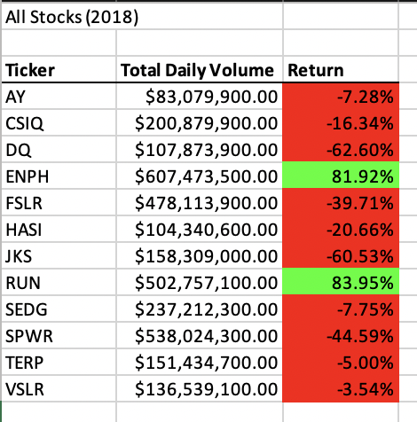

# stock-analysis

## Overview 

In this project, we used VBA to analyze stock performace for a client using an excel data source. Initially, we analyzed one stock with the ticker DQ while using VBA to calculate the stock's Total Daily Volume and yearly returns. After creating this analysis, the code was then expanded out to analyze all stock's in the data source to identify which might be the most profitable for ongoing investment. 

## Results 

To analyze all stocks in the data for years 2017 and 2018, we created an input box that asks the user which year they would like to analyze and then puts that into the formula Worksheets("All Stocks Analysis").Activate to ensure that we are looking at the correct data. We then created arrays for the variables Ticker, TickerVolume, TickerStartingPrice, and TickerEndPrice. The Ticker array is set equal to each ticker we see available in this data set, and we calculated the answers for the following. We can use the integer type variable tickerindex to reference these arrays later in the code. 

We then used the code in the picture below to calculate the answers for volume, starting price, and ending price: 

We then used a For loop to insert the outputs of each of these arrays into a table in the "Analyze All Stocks" worksheet for the user to reference. The formula of "end price/start price - 1" was used to calculate Returns for each stock. Attaching these subroutines to buttons in the excel worksheet makes it easier for future users to run these analyses without them needing to know VBA themselves. 

From this work we can see that in 2017,the majority of stocks are profitable with DQ and SEDG leading the with 199% and 184% returns respectively: 

However in 2018, most stocks see losses with only ENPH and RUN seeing postive returns: 

From this, we would need more information about what event occurred that's let to most stocks seeing a dip in value so that we can better understand how RUN and ENPH maintained profitability and if they are likely to continue this trend. 

We can safely say that this is an effective way of providing analysis of large amounts of data for users that are not familiar with how to do this themselves because the code can run for both years in almost a tenth of a second. 

  

## Summary

One great benefit to refactoring code is that once you revisit a line of code after seeing the whole picture, it is possible to think of a shorter or simpler line of code that gets to the same end result. This can result in streamlined processes and can improve your own coding skills. However, this can be hard to accomplish if it's not clear when reading through the code what each line is trying to accomplish. This is why heavily commenting on the code is very highly recommended so that future readers can clearly see what the goal is and can evaluate if it's the best route to that end goal. I see this clearly in this refactoring example as I had to revisit the original code a few times in order to understand next steps and to see if there were any things I was missing. 
